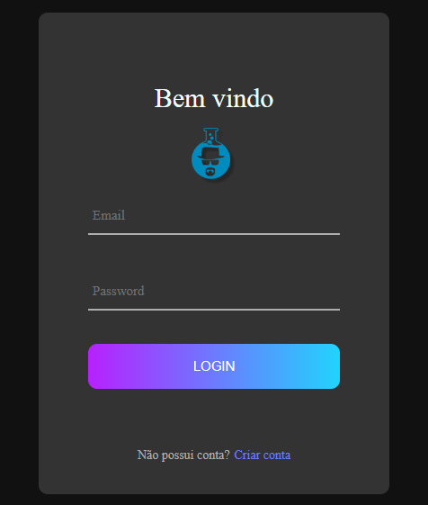

# Tela-de-Login-com-React

<h5>Detalhes a se destacar no projeto</h5>

<ul>
     <li>O Projeto tem o foco em Práticar Display Flex e Responsividade ⌨️</li>
     <li>Nesse projeto foi utilizado useState para a animação do campo Email e Password 🔒</li>
</ul>
 

 
